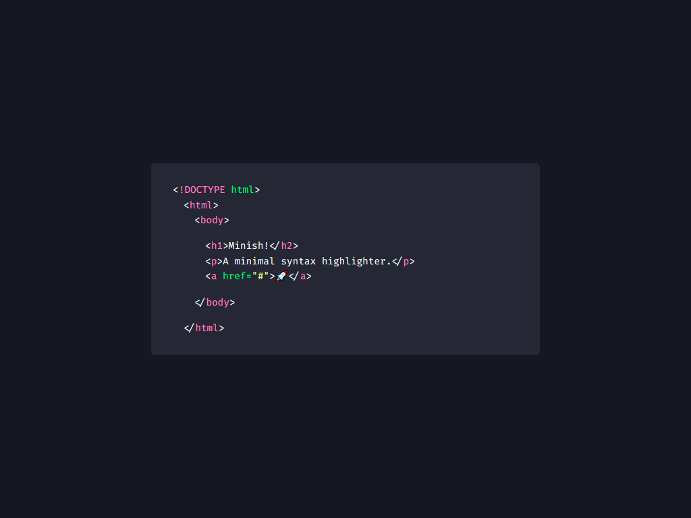

# Minish

> Minish the minimal syntax highlighter.

A Javascript library without dependency, lightweight, flexible and fast. Designed to highlight:

* HTML
* CSS
* JS (:hammer_and_wrench: WIP).

## Table of contents

 - [How to set up](#how-to-set-up)
 - [How to use](#how-to-use)
 - [Copyright and License](#copyright-and-license)

## :receipt: How to set up

### by CDN

You can use **Minish** by CDN, provided by the :mechanical_arm:[jsDeliver](https://www.jsdelivr.com/) service, below:

```
<link rel="stylesheet" href="https://cdn.jsdelivr.net/gh/luxonauta/minish@latest/dist/minish.css">

<script src="https://cdn.jsdelivr.net/gh/luxonauta/minish@latest/dist/minish.js" defer="true" crossorigin="anonymous">
```

### By Download

You can also download the files from the [dist/](https://github.com/luxonauta/minish/tree/master/dist) folder and include them in your HTML with a `link` and `script`.

```
<link rel="stylesheet" href="my-path/minish.css">

<script src="my-path/minish.js" defer="true">
```

### Rewrite and Change

If you want to rewrite or change something, to better suit your needs.

You can start by cloning the repository:

```
git clone https://github.com/luxonauta/luxa.git
```

This project needs [Node](https://nodejs.org/en/), as we use [Gulp](https://gulpjs.com/).

Make sure you installed it with the following commands:

```sh
node --version
```

```sh
npm --version
```

```sh
npx --version
```

If they are not installed, follow the instructions [here](https://nodejs.org/en/).

#### Install the Gulp command line utility

You can install it following the [Gulp installation tutorial](https://gulpjs.com/docs/en/getting-started/quick-start), or you can simply run the command on your terminal:

```sh
npm i
```

#### Verify your Gulp versions

```sh
gulp --version
```
#### Test it

Now all you have to do is initialize it:

```sh
npm run gulp
```

And you're ready! :ok_hand::grin:

## :rocket: How to use

To use it, the syntax to be highlighted needs to be encapsulated by a `<pre>` tag.

You can add a button with the class `.js-copy` to copy the content with a click.

Add the `code` tag with the data attribute `data-language` of the language you want to highlight.

For each line, encapsulate the content in a `span` tag with the `.line` class, and define the indentation with the date attribute `data-indent`.

See the example bellow:

```
<pre>
    <button class="js-copy">Copy</button>
    <code data-language="html">
        <span class="line">&lt;!DOCTYPE html&gt;</span>
        <span class="line" data-indent="1">&lt;html&gt;</span>
        <span class="line" data-indent="2">&lt;body&gt;</span>
        <span class="line"></span>
        <span class="line" data-indent="3">&lt;h1&gt;Minish!&lt;/h2&gt;</span>
        <span class="line" data-indent="3">&lt;p&gt;A minimal syntax highlighter.&lt;/p&gt;</span>
        <span class="line" data-indent="3">&lt;a href="#"&gt;🚀&lt;/a&gt;</span>
        <span class="line"></span>
        <span class="line" data-indent="2">&lt;/body&gt;</span>
        <span class="line"></span>
        <span class="line" data-indent="1">&lt;/html&gt;</span>
    </code>
</pre>
```

Check the result below:



## Copyright and License

Copyright (c) 2021 [Lucas de França](https://github.com/luxonauta). Code released under [the MIT license](https://github.com/luxonauta/minish/blob/master/LICENSE).

English is not my native language, if there are any grammatical errors, please feel free to correct me, I will be very grateful!